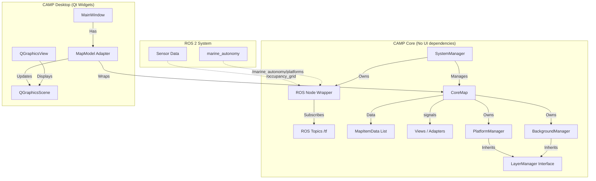

# High-Level Architecture Design

## System Overview

The `camp2` refactoring aims to decouple the Core Business Logic from the User Interface, enabling Headless operation and easier testing.

## Component Diagram

## Key Interactions

1.  **Startup**:
    *   **Headless**: `main.cpp` instantiates `SystemManager`. Signal handlers are connected to local logic or logging.
    *   **Desktop**: `main.cpp` instantiates `QApplication`, then `SystemManager`, then `MainWindow`. `MainWindow` creates `MapModel` initialized with `SystemManager`'s `CoreMap`.

2.  **Data Flow (Platform Update)**:
    *   `ROS Node Wrapper` receives `PlatformList` msg.
    *   `PlatformManager` (in Core) processes msg, updates `MapItemData` (Position, Status).
    *   `MapItemData` emits `dataChanged` signal.
    *   **Desktop**: `MapModel` (connected to `dataChanged`) triggers `QGraphicsScene` update to move the icon.
    *   **Headless**: No visual update, but internal state is current. A generic "mission constraint checker" could verify the new position against safe zones.
